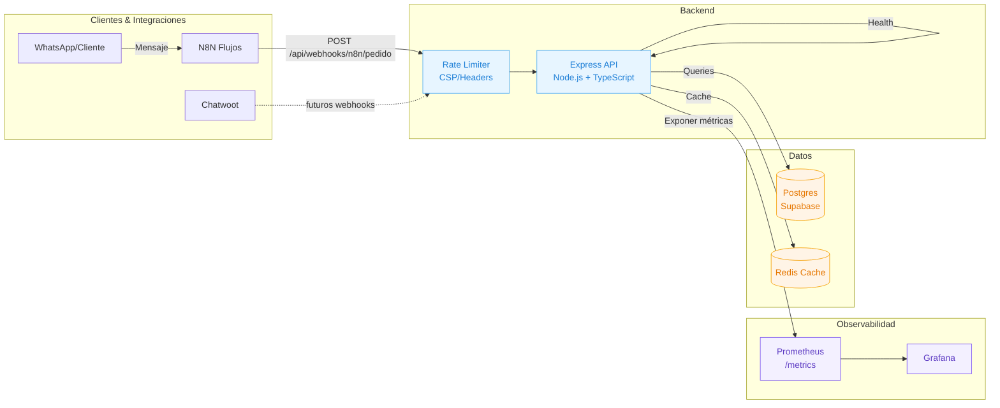

# Arquitectura SIST_PIZZA (vista alta)

Notas rápidas:
- Backend expone: GET /health, GET /api/health y GET /metrics, más POST /api/webhooks/n8n/pedido.
- Seguridad básica: rate limit específico en ruta de webhooks y cabeceras de seguridad.
- Observabilidad: Prometheus scrapea el backend y Grafana consume esas series.
- Base de datos: Postgres/Supabase como fuente de verdad; Redis para cache simple.
